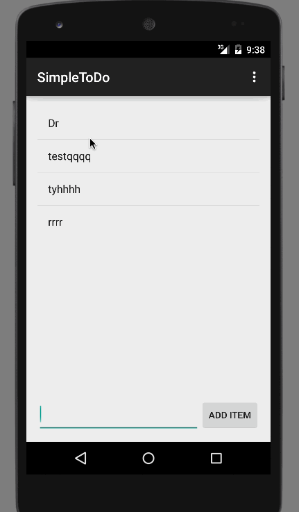

This is an Android application developed while learning about Android in Workshop. It is the most simple app to create TODO list. Tutorial provided by thecodepath.

Time spent: 5 hours spent in total

Completed user stories:

 * [x] Required: User can add and remove items from the todo list
 * [x] Required: User can click any TODO list item and edit it
 * [x] Reaired: The items in the list are persistent using file
 
Notes:

Spent time setting up environment

Walkthrough of all user stories:

GIF created with [LiceCap](http://www.cockos.com/licecap/).
